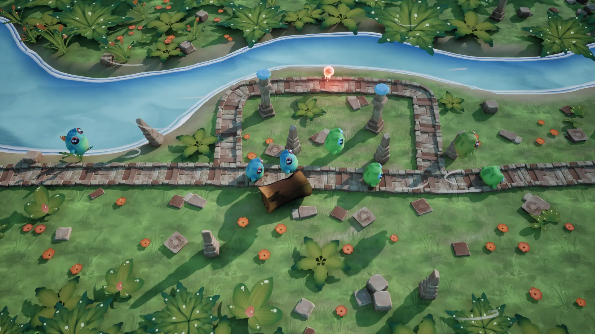
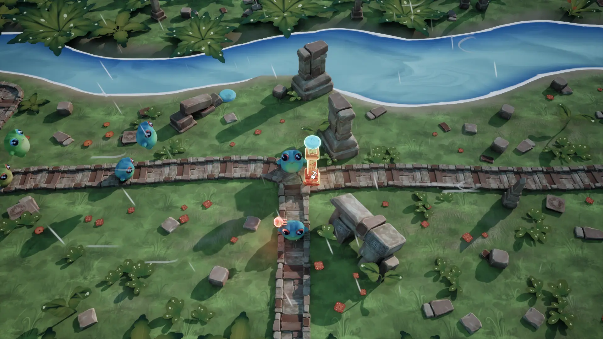

# Frog This Way

A puzzle mini-game created for the Ubisoft Volunteer Week Game Jam 2025. Guide a tribe of frogs through a forest before a massive storm arrives by interacting with the environment.

---

## Table of Contents

- [About](#about)
- [Game Screens](#game-screens)
- [Key Features](#key-features)
- [Controls](#controls)
- [Team](#team)
- [Installation](#installation)

---

## About

**The storm is coming!** Help the frogs return to their habitat through the forest by clearing the path for them.

Frog This Way is a Lemmings-style puzzle game where players guide a continuous stream of frogs from point A to point B. The climate is disrupted, a violent storm is approaching, and the frogs need to reach their ancestral ruins for shelter.

**Gameplay:**
- God-game perspective with top-down isometric view
- Interact with the environment using mouse-only controls
- Click and drag natural elements to redirect frog paths
- Complete casual mini-games to unlock alternative routes
- Collect sap along the way to restore the ancestral ruins
- Progressive storm atmosphere with rain, wind, and thunder

The game features 8 levels with increasing difficulty and atmosphere intensity as the storm approaches.

## Game Screens





---

## Key Features

- **Continuous Flow Mechanics**: Frogs spawn automatically and follow spline paths
- **Environmental Puzzles**: Click or drag-and-drop objects to clear paths
- **Dynamic Path System**: Unlock variant paths by completing mini-games
- **Collectible System**: Gather sap attached to frog
- **Weather Effects**: Progressive storm with rain, wind, and darkening atmosphere

---

## Controls

**Mouse:**
- Click & Drag: Move natural elements to redirect frog paths
- Repeated Clicking: Clear pillars and obstacles

**Keyboard:**
- Pause : `P` 

---

## Team

**Programmers:**
- [Léo Séry](https://github.com/LeoSery) - Lead Developer
- [Dorian Fonseca](https://github.com/Dorian2002) - Developer

**Artists:**
- [Macélie Fouchier](https://www.artstation.com/fouchier) - Lead Artist
- [Luca Mazzilli](https://www.artstation.com/luca-mazzilli) - Artist
- [Arthur Mutaux](https://www.artstation.com/mutauxarthur8) - Rigger

**Game Designer:**
- [Sacha Pessin](https://www.linkedin.com/in/sacha-pessin-032720185/) - Game Designer

---

## Installation

### Play the Game

**Online:**
- [Play on itch.io](https://rock-salad.itch.io/frog-this-way)

### Development Setup

**Requirements:** Unreal Engine 5.7 or later

1. Clone the repository:
```bash
git clone git@github.com:RockSaladStudio/Ubisoft-Volunteer-Week-Game-Jam--2025.git
```
or
```
git clone https://github.com/RockSaladStudio/Ubisoft-Volunteer-Week-Game-Jam--2025.git
```
2. Open `UVWGJ25.uproject` in Unreal Engine

---

## Inspiration

**Gameplay:** Lemmings, Kabuto Park
**GameJam Theme:** *"Weathering the Storms: From Preparation to Action to Reconstruction."*

---

Made with 💚 during `Ubisoft Volunteer Week Game Jam 2025`